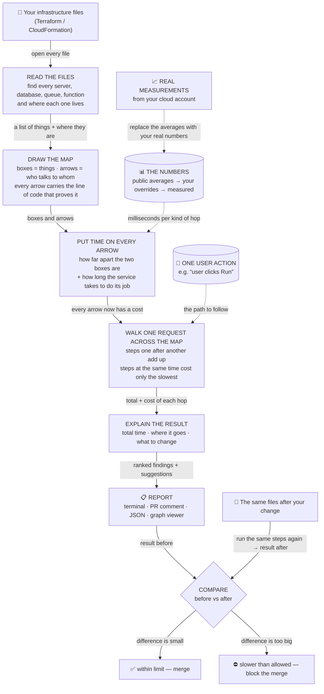

# iacsim — how it works, in one picture

**The question we answer:** *"If I change my infrastructure, how slow will my app feel — before I deploy?"*

## The same thing in five lines

1. **Read** your infrastructure code and list everything in it.
2. **Map** it: boxes for things, arrows for who talks to whom, with proof for every arrow.
3. **Price** every arrow in milliseconds — distance plus the time the service takes.
4. **Walk** one real user action across the map and add it up.
5. **Explain** where the time goes, what to change, and what your next change would do.

## Three rules that make the numbers honest

- **Every arrow has evidence** — a sentence pointing at the line of code that proves it. A wrong guess is visible and can be corrected.
- **We compare, we don't prophesy** — "moving the database costs +299 ms" is reliable even when the base numbers are averages. The report always says which numbers it used.
- **Nothing is hard-wired** — a new cloud, file format or data source is a plugin you drop in. The engine never changes.

## One real example

Same app, two versions. The only difference: the database moved to another region.

| | page load |
|---|---|
| database in the same region | **57 ms** |
| database one region away | **356 ms** |
| the tool's verdict | *"+299 ms, 96 % is distance — bring the database back"* |

Found from the code alone, before anything was deployed.
